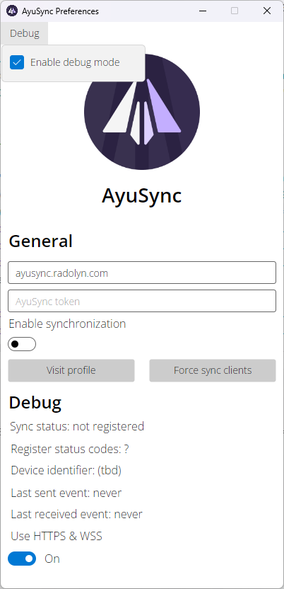

# AyuSync Agent

Just a simple AyuSync backend for Telegram Desktop.

## Preview

## Why?

Because websocket libs for C++ suck.

## How does it work?

When needed, Telegram Desktop launches this agent and starts receiving websocket requests from it.

Processes communicate through pipes.

Agent creates named pipe `AyuSync` for Telegram Desktop and `AyuSyncAgent` for Preferences GUI.
